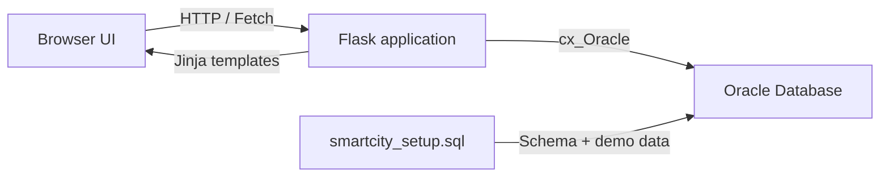
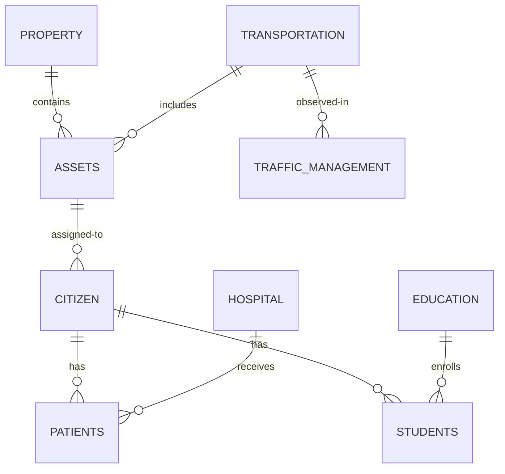

# Smart City Management System

A Flask and Oracle Database web dashboard for exploring and managing smart-city data across citizen services, transportation, traffic, property, healthcare, education, and public assets.

> This repository is an educational prototype intended for local development and database coursework. It is not production-ready and should not be exposed directly to the public internet.

## Overview

The application provides one browser-based interface for nine connected data domains. It reads the selected Oracle table, builds forms from the live table schema, and supports common CRUD operations without requiring a separate page for every module.

The included SQL script creates the schema and loads 118 demonstration records, making the project easy to explore with a local Oracle XE installation.

## Features

- View records from any supported city-management table.
- Insert records through schema-aware forms.
- Update records using configurable conditions.
- Delete records with a browser confirmation step.
- Search and filter records without a full page refresh.
- Handle Oracle `DATE`, `TIMESTAMP`, numeric, and text fields.
- Load a complete sample schema and demonstration dataset from one SQL script.
- Keep database credentials outside source control through environment variables.

## Managed modules

| Module | Table | Purpose |
| --- | --- | --- |
| Citizens | `Citizen` | Resident profiles and linked assets |
| Assets | `Assets` | Connections between residents, vehicles, and property |
| Property | `Property` | Property type, address, area, value, and category |
| Transportation | `Transportation` | Vehicle registration and specification records |
| Traffic | `Traffic_Management` | Location, timestamp, vehicle, and speed observations |
| Hospitals | `Hospital` | Healthcare facility information and capacity |
| Patients | `Patients` | Patient visits, diagnoses, and hospital references |
| Education | `Education` | Educational institutions, rankings, and capacity |
| Students | `Students` | Student enrollment and grade records |

## Architecture



Conceptual data relationships:



The diagram summarizes the intended model. The current SQL script explicitly enforces the `Citizen` to `Assets` and `Traffic_Management` to `Transportation` relationships; the remaining links are represented by matching identifier columns.

## Technology stack

- Python and Flask
- Jinja2 templates
- Oracle Database / Oracle XE
- `cx_Oracle`
- HTML, CSS, and vanilla JavaScript

## Project structure

```text
.
|-- main.py                 # Flask routes and Oracle data operations
|-- smartcity_setup.sql     # Schema creation and 118 demo records
|-- requirements.txt        # Python dependencies
|-- .env.example            # Safe configuration template
|-- templates/
|   |-- index.html          # Main dashboard and data grid
|   |-- insert_form.html    # Insert form
|   |-- update_form.html    # Update form
|   |-- delete_form.html    # Delete form
|   `-- search_form.html    # Search form
`-- README.md
```

## Prerequisites

- Python with support for the dependency versions in `requirements.txt`.
- Oracle Database, Oracle XE, or another compatible Oracle instance.
- Oracle Instant Client and any platform runtime required by `cx_Oracle`.
- SQL*Plus, SQLcl, or Oracle SQL Developer for running the setup script.

On Windows, `cx_Oracle` may also require the supported Microsoft Visual C++ runtime.

## Installation

1. Clone the repository and enter its directory:

   ```bash
   git clone https://github.com/muhammadzain-byte/Smart-City-Management-System-.git
   cd Smart-City-Management-System-
   ```

2. Create and activate a virtual environment:

   Windows PowerShell:

   ```powershell
   python -m venv .venv
   .\.venv\Scripts\Activate.ps1
   ```

   macOS or Linux:

   ```bash
   python3 -m venv .venv
   source .venv/bin/activate
   ```

3. Install the dependencies:

   ```bash
   python -m pip install --upgrade pip
   python -m pip install -r requirements.txt
   ```

4. Create your local configuration:

   Windows PowerShell:

   ```powershell
   Copy-Item .env.example .env
   ```

   macOS or Linux:

   ```bash
   cp .env.example .env
   ```

5. Edit `.env` with the credentials for a dedicated, least-privileged Oracle schema:

   ```dotenv
   ORACLE_USER=smartcity_app
   ORACLE_PASSWORD=replace-with-your-password
   ORACLE_DSN=localhost:1521/xepdb1
   FLASK_DEBUG=false
   ```

   The `.env` file is ignored by Git and must never be committed.

## Database setup

Connect to the same Oracle schema configured in `.env`, then run the script in SQL*Plus or SQLcl:

```sql
@smartcity_setup.sql
```

In Oracle SQL Developer, open `smartcity_setup.sql` and use **Run Script**.

The script drops and recreates the nine application tables before inserting demonstration data. Use it only with a development schema whose existing copies of these tables may safely be replaced. On the first run, Oracle can report that a table does not exist during the initial cleanup; continue with the create and insert statements.

## Run the application

```bash
python main.py
```

The application starts at [http://127.0.0.1:5000](http://127.0.0.1:5000) and attempts to open the page in the default browser.

## Using the dashboard

1. Choose a table from the selector.
2. Review the loaded records in the data grid.
3. Select **Insert**, **Update**, **Delete**, or **Search**.
4. Complete the generated form and submit it.
5. Refresh or reselect the table to view the latest data when needed.

## Security and limitations

- Use a dedicated Oracle user; do not run the application with `SYS`, `SYSTEM`, or another administrator account.
- The current prototype has no login, authorization, CSRF protection, audit log, or role separation.
- Some database statements are generated dynamically and require further hardening before any production use.
- Flask debug mode is disabled by default. Enable it only during trusted local development.
- The seed records are demonstration data and should not be treated as verified real-world information.

## Suggested next steps

- Add authentication and role-based access control.
- Convert all dynamic filters to validated, parameterized queries.
- Add CSRF protection and structured validation.
- Add automated unit and integration tests.
- Add pagination, empty states, and user-friendly error messages.
- Add screenshots or a short dashboard demo.
- Package the application with a repeatable deployment configuration.
